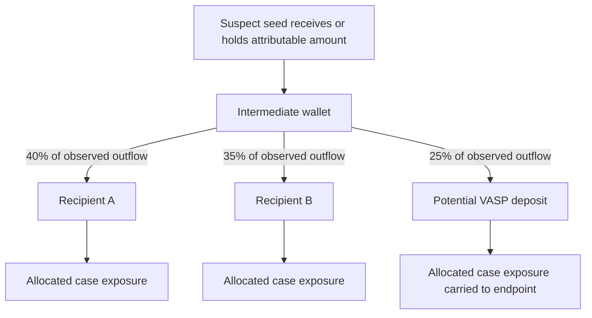
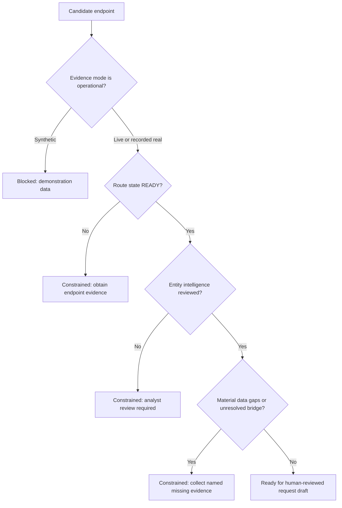
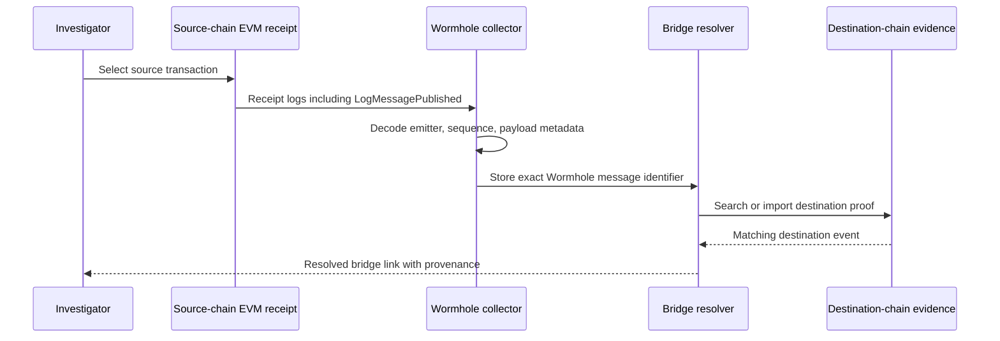
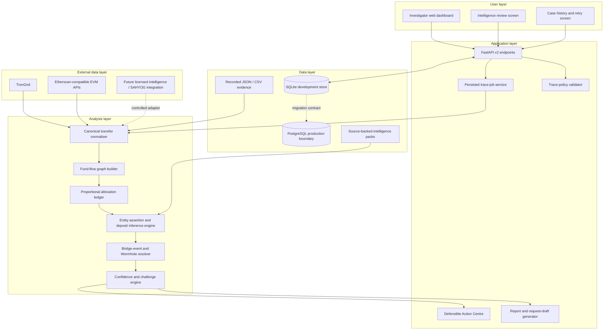
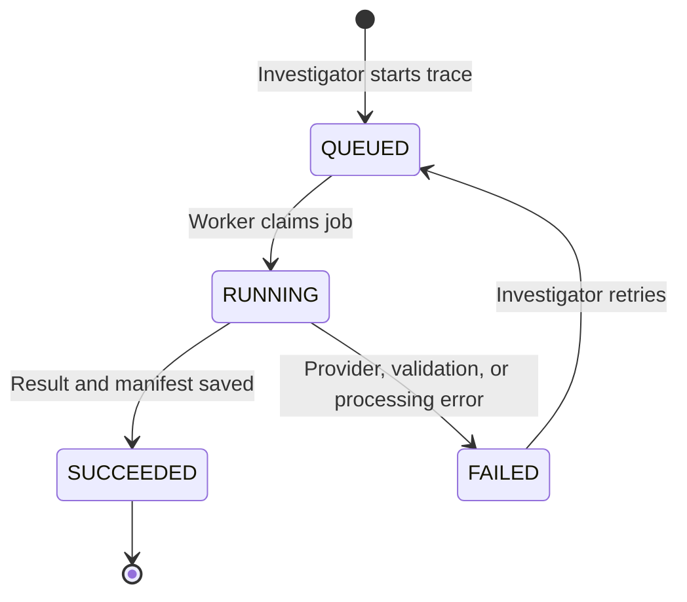
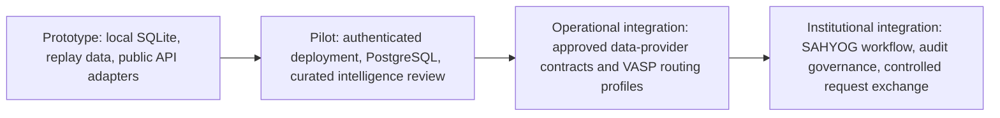
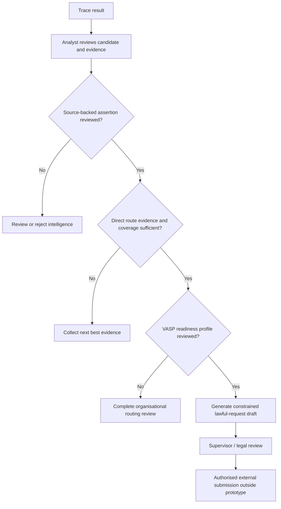

# VASP Trace — Detailed SIH 182 Project Documentation

> **SIH Problem Statement 182:** Automated attribution of unknown cryptocurrency wallets to the nearest Virtual Asset Service Provider (VASP) through blockchain intelligence APIs.
>
> **Project:** VASP Trace — an evidence-first, multi-chain investigation support platform for lawful cybercrime and financial-crime investigations.

## Purpose of this document

This document is organised as a detailed companion to a presentation deck. Each major topic that would appear on the slides is expanded here with the reasoning, workflows, boundaries, implementation details, and demonstration approach behind it. It describes the prototype as it exists today, while clearly distinguishing completed local functionality from integrations that require access to external data providers, VASPs, or government systems.

## Contents

1. [Problem context](#1-problem-context)
2. [Proposed solution](#2-proposed-solution)
3. [How VASP Trace solves the problem](#3-how-vasp-trace-solves-the-problem)
4. [Innovative features](#4-innovative-features-that-make-vasp-trace-different)
5. [Technical approach and architecture](#5-technical-approach-and-architecture)
6. [Technology stack](#6-technology-stack)
7. [Feasibility and viability](#7-feasibility-and-viability)
8. [Challenges and mitigation strategies](#8-challenges-and-mitigation-strategies)
9. [Impact and benefits](#9-impact-and-benefits)
10. [Judge demonstration flow](#10-judge-demonstration-flow)
11. [Current scope and implementation status](#11-current-scope-and-implementation-status)

---

# 1. Problem context

Law-enforcement investigators often begin with a limited piece of evidence: a cryptocurrency wallet address reported by a victim, found in a fraud message, associated with a ransomware payment, or recovered from a device. That address may be an **unhosted wallet**, an address controlled by a criminal, or an intermediate address that only forwards funds. It usually does not identify the individual or exchange that can provide account records or preserve assets.

The useful investigative question is therefore not merely *“where did the money move?”* It is:

> **Which identifiable VASP, custodial service, or direct-deposit accepting endpoint is most strongly supported by the available evidence, what amount is defensibly linked to it, and what evidence is still required before a lawful request is prepared?**

That question has several difficulties:

- A transaction can fan out to many wallets, consolidate again, pass through token swaps, or traverse bridges between chains.
- A balance arriving at an exchange may contain both suspect funds and unrelated historic funds. Treating the entire outgoing balance as suspect would be misleading.
- Public blockchain data describes transfers, but it does not by itself prove a person’s identity or a VASP customer relationship.
- Address labels from public sources can conflict, become outdated, or have uncertain provenance.
- A bridge transfer must be linked across source and destination chains with protocol-level evidence; matching only value and time is weak.
- Investigators need a readable report and a reviewable path to action, rather than an opaque graph or a black-box risk score.

VASP Trace is designed around these realities. It accelerates research, preserves provenance, makes uncertainty visible, and prevents unsupported conclusions from being presented as facts.

---

# 2. Proposed solution

## 2.1 VASP Trace in one sentence

**VASP Trace turns a suspect wallet and case context into a repeatable, evidence-backed transaction trace that identifies potential nearby VASP endpoints, calculates the defensible exposure that reaches each endpoint, and states the next evidence needed for a lawful investigator action.**

## 2.2 What the platform does

The platform is a web-based investigation workspace with a local Python backend. An investigator creates a case, enters an address and blockchain network, selects a trace policy, and starts a trace. The engine retrieves transaction data from configured public blockchain providers or replayable evidence files, normalises the data, builds a directed fund-flow graph, and produces an immutable result package.

The result package supports five connected tasks:

| Task | What the system provides | Why it matters |
|---|---|---|
| **Transaction tracing** | A hop-limited, time-bounded path from a seed address to downstream recipients. | Converts manual blockchain exploration into a consistent workflow. |
| **Endpoint attribution** | Candidate entities and VASPs based on source-backed intelligence assertions. | Helps investigators identify the likely organisation to contact. |
| **Fund accounting** | Proportional allocation of observed suspect funds across outgoing transfers. | Avoids claiming that an entire mixed wallet balance belongs to the case. |
| **Evidence assessment** | Evidence manifests, confidence explanations, data coverage, conflicts, and limitations. | Makes a result reviewable by a supervisor, legal team, or external VASP. |
| **Action preparation** | A Freezeability Envelope, readiness profile, next-best-evidence steps, and a request draft. | Converts analytical output into a structured decision-support workflow. |

## 2.3 Proposed solution components

### A. Case workspace

A case is the organisational unit for an investigation. It holds a case reference, investigator context, trace jobs, saved results, intelligence reviews, reports, and actionability assessments. Results are kept rather than overwritten, so an investigator can compare an earlier trace with a later retry or with a different policy.

### B. Trace policy

The trace policy defines what the system is allowed to analyse. It includes maximum hop depth, a time window, asset filters, value thresholds, and whether certain known services should be expanded or treated as endpoints. This is important because a path in a blockchain is not automatically an investigative path. A policy makes the scope explicit and reproducible.

### C. Chain data adapters

The prototype supports live retrieval through public APIs where credentials are configured, including TronGrid and Etherscan-compatible APIs for Ethereum, BNB Chain, and Polygon. It also supports recorded JSON or CSV data, which allows the same trace to be replayed in a demo, test, or controlled evidence workflow.

### D. Attribution intelligence

VASP Trace stores entity information as **assertions**, not absolute truths. Every assertion has a source, source tier, observed date, review state, entity type, tags, and optional rationale. An analyst can approve or reject imported claims. Conflicting claims remain visible.

### E. Defensible Action Centre

The Action Centre is the project’s central differentiator. It does not say “freeze this amount” automatically. It displays whether the evidence is ready for a lawful request, what route state has been inferred, the maximum amount that is locally supportable by the result, the reasons a claim is blocked or constrained, and the next strongest evidence to obtain.

---

# 3. How VASP Trace solves the problem

## 3.1 From an unknown wallet to a structured investigative lead

The typical workflow starts with an address that has no known owner. The engine traces observable movements from that seed and identifies downstream addresses that are labelled or inferred as potential custodial endpoints. The result is a ranked set of **candidates**, not a declaration of ownership.

For each candidate, the investigator can see:

- the observed path from the seed address;
- transfers and transaction identifiers supporting the path;
- the chain and asset involved;
- the amount of case-linked value calculated by the allocation engine;
- entity assertions and their sources;
- contradictory assertions or missing review;
- whether a bridge created a chain transition;
- confidence factors and limitations; and
- whether the available evidence can support a request draft.

## 3.2 Live retrieval, recorded evidence, and synthetic demonstration data

VASP Trace deliberately labels the origin of data. A result is assigned one of three modes:

| Mode | Meaning | Suitable use |
|---|---|---|
| **LIVE** | The backend retrieved data from a configured external blockchain provider during the trace. | Current investigation research, subject to provider coverage and rate limits. |
| **RECORDED_REAL** | The trace was replayed from saved data that originated from a real provider or evidence collection. | Reproducible investigation review, demonstrations, regression testing. |
| **SYNTHETIC** | The trace uses deliberately created sample data. | UI demonstrations and learning only. |

The system treats these modes differently. A synthetic result cannot become an action-ready request. This prevents a polished demonstration path from being confused with operational evidence.

## 3.3 Defensible fund accounting: proportional allocation

A central problem in blockchain tracing is **commingling**. A wallet may receive case funds along with unrelated funds, then make several outgoing transfers. A simplistic tracing tool might attribute its whole outgoing balance to the investigation. VASP Trace uses a conservative proportional allocation approach for observed transfers.

If a wallet has an attributable amount \(A\) and sends total observed outgoing value \(O\), an outgoing transfer of value \(v_i\) receives an allocated case amount:

\[
allocated_i = A \times \frac{v_i}{O}
\]

The allocated amounts are then propagated downstream within the trace policy. The calculation does **not** prove legal ownership. It describes the fraction of observed flow that the trace can connect to the seed under the stated assumptions.

The report records important qualifications: partial transaction-history coverage, historic balance, incomplete provider response, same-asset assumptions, and any bridge or swap discontinuity.

## 3.4 Endpoint identification and route states

The system distinguishes an address-level observation from a direct VASP deposit route. A labelled exchange hot wallet is useful intelligence, but it is not always the same as a customer deposit address. VASP Trace uses route states to express this distinction:

| Route state | Meaning |
|---|---|
| **UNKNOWN** | The address has no usable endpoint evidence. |
| **POSSIBLE** | A label or behavioural signal suggests a service relationship, but evidence is incomplete. |
| **INFERRED** | Multiple indicators support a likely service endpoint, but it is still an inference. |
| **READY** | Reviewed entity intelligence and route evidence support preparation of a lawful request draft. |

The difference is operationally important. A candidate marked *inferred* should guide an investigator toward further verification. It should not silently become a request to freeze a customer account.

## 3.5 Automated confidence with explanations

The project computes confidence from explicit signals rather than a hidden model. Positive factors can include a reviewed, high-tier source; direct path evidence; a resolved bridge link; and strong endpoint signals. Negative factors include provider truncation, mixed historic balance, unresolved bridge routes, conflict between entity assertions, and unreviewed intelligence.

The user sees the reasons for the score. This helps a supervisor challenge the evidence and enables the engine to suggest what will improve the case.

---

# 4. Innovative features that make VASP Trace different

## 4.1 The Defensible Action Centre and Freezeability Envelope

Most tracing dashboards stop at a graph and a risk score. VASP Trace adds a decision layer called the **Defensible Action Centre**. Its output is the **Freezeability Envelope**: a structured explanation of whether a candidate has enough evidence for a lawful request draft and what amount, if any, is locally supportable.

The envelope contains:

- candidate entity and address;
- inferred VASP route state;
- evidence mode and data coverage;
- allocation-backed case exposure;
- evidence challenges with severity;
- VASP readiness information, such as known legal-contact process or jurisdictional notes;
- a suggested next-best-evidence action; and
- a readiness conclusion: blocked, constrained, or ready for reviewed drafting.

A non-zero locally supportable amount appears only where the candidate has a reviewed VASP profile, a **READY** route state, and no blocking evidence challenge. The platform still does not send a freezing instruction. Human legal and operational review remain required.

This feature gives judges a clear answer to the difficult question: *“How does the platform avoid false positives when it recommends a VASP?”*

## 4.2 Adversarial Evidence Challenge Engine

The platform actively looks for reasons its own conclusion may be wrong. Instead of displaying only confidence-raising signals, it produces challenge cards such as:

- **Synthetic data:** a demonstration dataset cannot support an operational request.
- **Inferred endpoint:** the route is not yet confirmed as a direct deposit path.
- **Partial provider coverage:** the trace may not include all relevant transactions.
- **Mixed historic balance:** the wallet’s pre-existing balance may affect allocation confidence.
- **Unresolved bridge route:** source-chain funds cannot yet be shown to map to the claimed destination-chain recipient.
- **Unreviewed or conflicting intelligence:** an imported label needs analyst validation.
- **Missing VASP readiness profile:** there is no reviewed information about the recipient organisation’s process.

Each challenge is assigned a severity. A blocker prevents an action-ready conclusion; a material challenge keeps the recommendation constrained. This design makes the prototype more defensible than a system that hides uncertainty behind a percentage.

## 4.3 Next-Best-Evidence recommendations

A trace result should tell the user what to do next. The system maps each limitation to a concrete evidence request. Examples include:

| Observed limitation | Next best evidence |
|---|---|
| Candidate is only an inferred endpoint | Obtain a reviewed VASP-owned deposit or hot-wallet assertion, or corroborate with service-specific patterns. |
| Bridge route unresolved | Collect destination-chain event or receipt evidence matching the protocol message identifier. |
| Transaction data truncated | Re-run with a provider and policy that cover the relevant time and hop range. |
| Entity label is unreviewed | Send the source-backed assertion to the intelligence review queue. |
| No routing profile exists | Create and review the VASP readiness profile before drafting an external request. |

This makes the product useful even when the answer is uncertain. It gives investigators an ordered path from weak evidence to stronger evidence.

## 4.4 Protocol-specific cross-chain evidence: Wormhole collector

Cross-chain tracing is a major source of misleading claims. A transfer on one chain followed by a similarly sized transfer on another chain is not enough to prove continuity. VASP Trace introduces a protocol-specific collector for **Wormhole** EVM source transactions.

The collector reads the `LogMessagePublished` event from a retained EVM transaction receipt and extracts a Wormhole message identifier based on the protocol’s source chain, emitter, and sequence number. The engine can then attempt to resolve that identifier against a destination-side bridge event.

A resolved bridge link strengthens a path; an unresolved link remains visible as a limitation. The prototype does not guess cross-chain continuity.

## 4.5 Source-backed public intelligence packs

The project includes a build script for an OFAC digital-currency review queue. It extracts recognised address indicators from the official SDN advanced export and creates CSV records with source links, dates, entity classification, tags, and `UNREVIEWED` status.

The pack is intentionally conservative:

- it identifies a public sanctions-related source, not VASP ownership;
- imports enter an analyst review workflow;
- records preserve their source and observation date;
- an imported record does not automatically create a trusted exchange label; and
- the script can be re-run to obtain a dated refresh.

The same ingestion model can later support carefully curated public packs for exchange hot wallets, mixers, bridge contracts, and deposit patterns, provided every record has appropriate provenance and review.

## 4.6 Deposit inference and entity-intelligence review

A potential VASP endpoint may be supported by a mix of signals: direct incoming patterns, known service assertions, cluster evidence, reusable deposit structures, contract activity, or public documentation. VASP Trace stores the inputs separately rather than collapsing them into one irreversible label.

Analysts can approve or reject assertions in the review screen and record a rationale. This is important for operational auditability: the platform can show **who reviewed what claim, from which source, and why**.

## 4.7 Reproducible evidence manifests and replay

Every saved trace includes an evidence manifest describing the source mode, policy, records, timestamps, provider details, and result version. Recorded data can be replayed to reproduce a result. This is useful for three reasons:

1. a demo remains stable even when public APIs rate-limit or change;
2. a supervisor can reproduce an investigator’s conclusion; and
3. a report can identify the evidence and policy that produced it.

---

# 5. Technical approach and architecture

## 5.1 Architecture overview

VASP Trace follows a layered architecture so that user workflows, chain retrieval, evidence processing, and storage can evolve independently. The frontend is a local investigator dashboard. The backend exposes versioned APIs and runs trace jobs. Provider adapters retrieve chain-specific data. The investigation engine turns retrieved events into a normalised graph, allocation ledger, candidate set, reports, and actionability assessment.

## 5.2 Frontend investigator workflow

The frontend is built for a judge or investigator to understand the workflow without needing to read backend logs. It exposes the following screens and actions:

| Workflow | User action | System response |
|---|---|---|
| **Create and trace** | Create a case, enter a chain and address, select a policy, start a trace. | Creates a durable job and displays status, result, graph, candidates, and evidence. |
| **Live lookup** | Use a configured provider key for a supported chain. | Retrieves current public transaction data through the relevant adapter. |
| **Evidence replay/import** | Upload recorded JSON or CSV trace records. | Builds a trace in `RECORDED_REAL` mode with preserved provenance. |
| **View fund movement** | Select a candidate, path, transaction, or graph node. | Shows path evidence, allocation, transaction records, labels, and caveats. |
| **Review intelligence** | Search an assertion by address and chain, approve or reject it with a rationale. | Stores the review state and makes the decision auditable. |
| **Review bridge evidence** | Enter a bridge event or extract Wormhole evidence from an EVM receipt. | Stores protocol-specific evidence and attempts an exact resolution. |
| **Assess actionability** | Open the Defensible Action Centre. | Displays route state, challenges, readiness, suggested evidence, and request constraints. |
| **Case history** | Reopen an old result or retry an interrupted trace job. | Makes trace work persistent across backend restarts. |

## 5.3 Canonical data model

Blockchains expose different transaction formats. The backend converts adapter output into canonical models before analysis. The core objects include:

- **Case:** the investigation container and human case reference.
- **Trace policy:** declared scope including hops, time range, assets, and thresholds.
- **Trace job:** durable lifecycle record for queued, running, successful, failed, or retrying analysis.
- **Canonical transfer:** normalised chain, transaction hash, source, destination, asset, amount, time, and provenance.
- **Trace result:** immutable saved output with graph, candidate findings, evidence manifest, and limitations.
- **Entity assertion:** a source-backed claim associating an address or cluster with an entity or service.
- **Bridge event:** a source or destination protocol event with message identifiers and provenance.
- **VASP readiness profile:** reviewed operational information used to prepare a lawful request draft.
- **Actionability assessment:** Freezeability Envelope, challenge set, next-best-evidence actions, and recommendation.

This design enables additional chains and providers to be added without forcing the user interface or report format to understand each provider’s raw schema.

## 5.4 Trace-job lifecycle

Trace execution is designed to be restart-safe at the local prototype level. Job state is saved in storage, allowing the UI to show prior outcomes and retry an interrupted job. The execution flow is:

A production deployment would move job execution to a dedicated queue and worker system, but the application contract already separates job state from result storage.

## 5.5 Chain adapters and provider boundary

Adapters isolate network-specific retrieval. A provider adapter should return canonical records plus retrieval provenance, such as endpoint name, query parameters permitted by policy, provider timestamp, transaction identifiers, and coverage warnings.

Implemented public integrations include:

- **TronGrid** for Tron transaction retrieval where a valid API key is configured.
- **Etherscan-compatible APIs** for Ethereum, BNB Chain, and Polygon, using their respective provider configuration.
- **Recorded data adapters** for deterministic JSON and CSV replay.

The design leaves room for licensed blockchain-intelligence feeds, full-node/indexer data, and official SAHYOG interfaces, each behind a controlled adapter. The current prototype never presents an unavailable provider as if it supplied evidence.

## 5.6 Evidence and report generation

The reporting layer transforms a saved result into investigation-ready material. It can produce structured case output, path details, candidate tables, evidence citations, allocation calculations, limitations, bridge records, and a constrained request draft.

A report is useful only when it tells a reviewer both what the system observed and what it did **not** establish. Therefore, reports retain limitations such as data mode, provider coverage, route inference, unreviewed labels, conflicts, and unresolved cross-chain events.

---

# 6. Technology stack

## 6.1 Current prototype stack

| Layer | Technology | Role in the project |
|---|---|---|
| **Frontend** | HTML, CSS, JavaScript | Local dashboard for cases, tracing, results, review, bridge evidence, reports, and actionability. |
| **Backend** | Python, FastAPI, Pydantic | Versioned API, validation, trace orchestration, canonical models, and response contracts. |
| **Persistence** | SQLite | Local development and prototype storage for cases, jobs, results, entity assertions, bridge events, reviews, and readiness profiles. |
| **Production database boundary** | PostgreSQL migration contract | Defines a path to stronger concurrent, managed persistence when deployed. |
| **Blockchain access** | TronGrid and Etherscan-compatible REST APIs | Public chain data retrieval for supported networks when keys are available. |
| **Cross-chain analysis** | Protocol-aware bridge models and Wormhole EVM event collector | Records source and destination evidence; attempts exact identifier-based bridge resolution. |
| **Testing** | Pytest | API, model, allocation, bridge, intelligence-pack, and workflow coverage. |
| **Packaging / local operation** | Docker and Docker Compose configuration | Repeatable local deployment boundary. |

## 6.2 Why this stack is feasible

FastAPI and Pydantic provide strict input validation and typed response models, which is valuable for evidence systems where invalid chain identifiers, malformed addresses, or missing provenance should be rejected early. SQLite reduces setup friction for a hackathon prototype, while the repository includes a PostgreSQL migration boundary so data access is not architecturally tied to a single local file.

The vanilla frontend keeps the demo portable. It can run as a local web interface without a complex build chain. The backend owns decisions such as confidence, allocation, and evidence restrictions, preventing the browser from becoming a source of unreviewable logic.

## 6.3 Security and data-handling approach

The application is intended for investigation support and should be deployed in a controlled environment. Current and planned controls include:

- API keys are supplied through environment configuration rather than committed source files.
- Backend validation constrains chains, policies, identifiers, and uploaded evidence shapes.
- Intelligence claims retain source, date, review state, and rationale.
- Results keep immutable evidence manifests rather than mutating a prior conclusion in place.
- External action remains a human-controlled draft workflow; the software does not automatically freeze, seize, or submit a request.
- A production deployment should add authentication, role-based access control, audit retention, encrypted storage, secure secrets management, network segmentation, and formal retention policy.

---

# 7. Feasibility and viability

## 7.1 What is already feasible locally

The prototype can already demonstrate the full internal analysis loop without needing permission from a VASP or government system:

1. create a case;
2. submit a trace using a live supported public API or recorded evidence;
3. normalise transfers and calculate downstream exposure;
4. inspect a graph and candidate endpoint;
5. import or review intelligence assertions;
6. add bridge evidence and attempt a Wormhole message resolution;
7. inspect evidence challenges and next-best-evidence suggestions;
8. generate an investigative report and constrained request draft; and
9. reopen saved history or retry jobs.

This is valuable because it proves the product workflow before external institutional integrations are available.

## 7.2 Operational viability

The system is viable as a decision-support layer because it does not depend on a single proprietary attribution provider. Public API data, recorded evidence, source-backed intelligence packs, internal review, and future licensed feeds all use the same canonical model. An organisation can begin with publicly accessible data and add stronger sources over time.

The evidence-first approach also makes the system appropriate for a law-enforcement workflow: conclusions are traceable to observations, reviewers can see gaps, and request drafting is conditional on readiness rather than being a fully automated enforcement action.

## 7.3 Incremental deployment path

This path avoids making the prototype dependent on permissions that a hackathon team cannot obtain immediately. Each phase preserves and strengthens the core evidence model.

## 7.4 Reliability controls

| Risk to a trace | Control in the project |
|---|---|
| Public API rate limit or outage | Explicit retrieval errors, recorded-data replay, mode labeling, and restartable jobs. |
| Provider returns incomplete history | Coverage limitations are shown in result evidence and the Action Centre. |
| Address label is wrong | Assertions retain source and review state; conflicts are visible; analysts can reject claims. |
| Internal data changes later | Saved result manifests preserve the evidence context used for the original analysis. |
| Bridge relationship is guessed | Protocol identifiers and explicit resolved/unresolved states prevent silent inference. |
| A user overstates a result | Challenge cards and route states constrain action wording and request readiness. |

---

# 8. Challenges and mitigation strategies

## 8.1 Blockchain-analysis challenges

| Challenge | Why it matters | VASP Trace response |
|---|---|---|
| **Address pseudonymity** | An address is not an identity, and one person or organisation can control many addresses. | Treats service attribution as source-backed assertions and candidate evidence, never direct identity proof. |
| **Commingled funds** | A recipient wallet may mix suspect value with unrelated balances and transfers. | Uses proportional allocation, observed-ledger records, and explicit historic-balance caveats. |
| **Data-provider gaps** | Public APIs can rate-limit, omit history, change schemas, or offer partial coverage. | Uses adapter provenance, coverage limitations, recorded replay, and retryable jobs. |
| **Cross-chain movement** | Bridges, swaps, and wrapped assets break simple same-chain path assumptions. | Uses bridge-event models and a Wormhole protocol collector; retains unresolved links as limitations. |
| **Ambiguous labels** | Public labels may be stale, incorrect, broad cluster labels, or disagree with each other. | Stores assertions with source tier, date, review state, rationale, and conflict visibility. |
| **Exchange wallet complexity** | Hot wallets, deposit addresses, sweep wallets, and internal exchange transfers have different meanings. | Separates entity labels, deposit inference, route state, and VASP readiness. |
| **Service obfuscation** | Mixers, tumblers, DeFi routers, and privacy-preserving services reduce trace certainty. | Identifies service categories where intelligence exists, lowers confidence, and surfaces evidence gaps. |
| **False actionability** | A graph can look convincing while being insufficient for a legal request. | Applies the Defensible Action Centre, blocking conditions, and human review before request drafting. |

## 8.2 Investigator adoption and workflow challenges

| Challenge | Mitigation |
|---|---|
| Investigators may not be blockchain specialists. | The UI uses a case workflow, labelled confidence reasons, visible limitations, reports, and concrete next steps rather than raw transaction dumps. |
| A team may rely too heavily on a single score. | The Action Centre presents challenge cards and explanation factors alongside any score. |
| Different analysts may reach different conclusions. | Declared trace policies, recorded evidence, immutable manifests, and review rationale support repeatability. |
| A case may need to be resumed later. | Saved result history and trace-job retry workflows preserve work across local restarts. |
| There may be no immediate relationship with the receiving VASP. | Readiness profiles organise known contact and routing information, while the system keeps unverified routes constrained. |

## 8.3 External-dependency challenges

Some capabilities require cooperation outside the codebase. They cannot be responsibly replaced by a mock claim.

| External dependency | Why it is needed | What can be done now |
|---|---|---|
| API credentials and provider terms | Live public blockchain retrieval depends on configured providers. | Use user-provided TronGrid and Etherscan-compatible keys, or replay recorded data. |
| Licensed blockchain intelligence | High-confidence proprietary clusters may be controlled by vendors. | Build source-backed public packs and retain an adapter boundary for future contracts. |
| VASP legal and compliance contacts | A correct endpoint must be contacted through an approved process. | Maintain reviewed VASP readiness profiles and generate drafts only for human review. |
| SAHYOG integration approval | Direct submission requires government interface access and authorised workflow design. | Implement the internal case, evidence, and draft contract so a future adapter can be added. |
| Institution security approval | Operational use requires authentication, retention, audit, and hosting approval. | Demonstrate local workflow and document the production hardening path. |

## 8.4 Safe request-preparation flow

The last step is intentionally outside the prototype’s autonomous control. The system supports preparation and evidence organisation; it does not make legal determinations or send an irreversible request without authorised human review.

---

# 9. Impact and benefits

## 9.1 Impact on investigation speed and quality

VASP Trace addresses the time-consuming portion of wallet attribution: manually opening explorers, copying transaction hashes, following multiple hops, comparing labels, and trying to explain why a downstream exchange is relevant. The platform makes that process repeatable and visible in one case workspace.

Expected practical benefits include:

- **Faster first-pass triage:** an investigator can move from a seed wallet to a structured candidate list more quickly than a purely manual exploration process.
- **Clearer handover:** saved cases, reports, and manifests let an analyst explain work to a supervisor or another investigator.
- **Better asset-preservation preparation:** the Action Centre highlights which candidate may be actionable and what evidence is missing before a draft is prepared.
- **Reduced overclaiming:** proportional allocation and evidence challenges prevent the output from implying that all funds in a wallet are necessarily case-linked.
- **Improved cross-chain awareness:** bridge evidence is represented explicitly instead of losing the trail when value moves between chains.
- **More consistent intelligence governance:** labels can be sourced, reviewed, rejected, and dated rather than embedded as unexplained hard-coded facts.

## 9.2 Benefits by stakeholder

| Stakeholder | Benefit |
|---|---|
| **Investigating officer** | A guided path from a reported wallet to candidates, evidence, report, and next action. |
| **Supervisor** | Reviewable confidence explanations, challenges, policy scope, and audit history. |
| **Financial / cybercrime unit** | More consistent approach to fund-flow analysis across cases and investigators. |
| **Legal / compliance reviewer** | A structured basis for deciding whether a request draft is supported and what should be qualified. |
| **VASP liaison team** | Better-organised transaction identifiers, dates, paths, and evidence rather than an unstructured address query. |
| **Victim and public interest** | Faster and more careful preparation can improve the chance of identifying a custodial touchpoint while reducing unsupported action. |

## 9.3 Multi-chain and cross-border relevance

Cybercrime proceeds frequently move through more than one chain and may reach a VASP operating in another jurisdiction. The prototype’s canonical model separates blockchain-specific retrieval from case evidence and reports. That provides a practical foundation for multi-chain work, even though the current live adapters cover a subset of chains.

The project also avoids assuming that a VASP label equals a local jurisdiction or that the system can compel action. VASP readiness information is represented as a reviewed organisational profile, allowing the operational team to record lawful-request routing knowledge separately from blockchain attribution.

## 9.4 Measurable evaluation for a pilot

A responsible pilot should measure more than graph size or number of labels. Suggested metrics include:

| Measure | Example interpretation |
|---|---|
| **Time to first candidate** | Time from seed entry to a source-backed endpoint candidate. |
| **Time to reviewable report** | Time required to produce a report with paths, calculations, provenance, and caveats. |
| **Candidate review precision** | Share of reviewed assertions that are retained as supported versus rejected or downgraded. |
| **Evidence-completeness rate** | Share of candidate results with sufficient provider coverage, reviewed intelligence, and resolved bridge evidence. |
| **Actionability conversion** | Share of constrained results that become request-ready after collecting the proposed next evidence. |
| **Reproducibility** | Whether the same recorded evidence and trace policy reproduce the same result. |
| **False-positive learning** | Number and causes of rejected assertions or blocked recommendations used to improve rules. |

These measures make the project testable in an operational setting without claiming outcomes that have not yet been independently validated.

---

# 10. Judge demonstration flow

## 10.1 Recommended six-to-eight minute demo

The strongest demonstration shows a complete investigator decision, including uncertainty. A suggested sequence is:

1. **Set the scene — 30 seconds.** Present a cyber-fraud case where only a suspect Tron or EVM wallet is known. Explain that the goal is a defensible nearby VASP lead, not simply a large graph.
2. **Create a case — 30 seconds.** Enter the case reference, seed wallet, chain, and trace policy. Explain that policy defines scope and makes the result repeatable.
3. **Run a trace — 60 seconds.** Use a recorded-real demo dataset for reliability, or live data if provider keys and connectivity are available. Show source mode and provenance.
4. **Inspect fund movement — 60 seconds.** Open the graph and a candidate route. Show transaction hashes, hop sequence, and proportional case-linked exposure.
5. **Show intelligence governance — 45 seconds.** Open a source-backed assertion, show its tier and review state, then approve or reject it with rationale. Point out that imported labels are not silently trusted.
6. **Show cross-chain evidence — 45 seconds.** Select a bridge record or demonstrate Wormhole EVM extraction. Explain the difference between an exact protocol message link and a weak value-and-time guess.
7. **Open the Defensible Action Centre — 90 seconds.** Show the Freezeability Envelope, route state, blockers or material challenges, and next-best-evidence recommendation. This is the key novelty demonstration.
8. **Prepare the report — 45 seconds.** Show the evidence manifest and constrained request draft. State that human legal review is required before external action.
9. **Show persistence — 30 seconds.** Open case history and explain that saved results and retryable jobs support real investigative work rather than one-time visuals.

## 10.2 Suggested spoken explanation for the novelty

> “Most tools can draw a transaction graph. Our platform asks the operational question that comes next: can this result responsibly support a request to a VASP? The Defensible Action Centre calculates the observed case-linked exposure, identifies the evidence that weakens the conclusion, checks whether the VASP route and readiness have been reviewed, and tells the investigator exactly what evidence to collect next. It makes uncertainty actionable instead of hiding it.”

## 10.3 Questions judges may ask and how to answer accurately

| Judge question | Accurate answer |
|---|---|
| **How do you know the exchange is the nearest VASP?** | The system ranks evidence-backed candidate endpoints within a declared trace policy. It does not claim certainty from graph proximity alone; route state, intelligence review, and coverage limitations are shown. |
| **Can it freeze funds automatically?** | No. It prepares evidence and a constrained draft for authorised human, legal, and institutional workflow. The prototype intentionally does not send automated freezing instructions. |
| **What makes this different from a normal blockchain explorer?** | It combines repeatable tracing, proportional fund allocation, source-governed entity intelligence, protocol-aware bridge evidence, and a challenge-driven actionability assessment. |
| **What makes it different from a generic graph dashboard?** | The product records provenance and limitations, challenges its own conclusion, and recommends the next evidence needed for a lawful route rather than only visualising transfers. |
| **How do you handle wrong labels?** | Labels are stored as sourced assertions with a review state, rationale, tier, dates, and visible conflicts. Analysts can reject them. |
| **What happens when a bridge is involved?** | The result stays constrained until a protocol-specific source-to-destination link is resolved. The Wormhole collector demonstrates extraction of an exact message identifier from an EVM receipt. |
| **Will public API rate limits break the system?** | The system reports provider errors and coverage limits, supports recorded-real replay, and persists jobs for retry. Live and recorded modes are clearly labelled. |
| **What needs to happen before SAHYOG integration?** | The authorised interface specification, security controls, data-retention policy, access approvals, and lawful process must be agreed. The internal evidence and request-draft contract is already designed for that future adapter. |

---

# 11. Current scope and implementation status

## 11.1 Completed internal prototype capabilities

The repository currently contains these internal capabilities:

- versioned canonical trace, evidence, entity, bridge, and actionability models;
- local FastAPI backend and local browser dashboard;
- case creation, trace-job persistence, result history, and retry workflow;
- public live adapters for TronGrid and Etherscan-compatible Ethereum, BNB Chain, and Polygon providers when configured;
- recorded JSON and CSV evidence replay;
- graph construction and proportional allocation through observed transfers;
- candidate entity assertions, conflicts, source tiers, analyst approval or rejection, and rationale;
- deposit-inference support and route-state presentation;
- evidence manifests and investigative report/request-draft support;
- bridge-event storage, exact bridge resolver, and Wormhole EVM `LogMessagePublished` extraction;
- Defensible Action Centre with Freezeability Envelope, challenge cards, VASP readiness profiles, and next-best-evidence recommendations;
- an OFAC digital-currency source-pack builder that produces an unreviewed review queue; and
- automated tests covering the major API and analysis paths.

## 11.2 Capabilities that need external data, agreements, or production approval

The following are planned integration steps, not claims of present production access:

- direct connection to the SAHYOG Portal or government workflow;
- direct submission of lawful disclosure or freezing requests;
- complete proprietary exchange-cluster attribution feeds;
- confirmed VASP customer-account mapping or KYC information;
- full live support for all chains named in the problem statement, including Bitcoin and Solana adapters;
- full destination-side discovery for every bridge protocol;
- organisation-grade authentication, authorisation, HSM or secrets platform, audit infrastructure, disaster recovery, and formally approved hosting.

## 11.3 Important boundaries

VASP Trace is an investigative intelligence and decision-support system. It does not establish ownership of a wallet, determine criminal liability, replace legal process, or guarantee recovery of assets. A VASP candidate is a lead backed by stated evidence, not an automatic assertion that an individual account has been identified.

These boundaries make the project safer and stronger in evaluation. A prototype that explicitly tracks uncertainty, provenance, and human review is more credible for operational adoption than one that promises conclusions the available data cannot prove.

## 11.4 Final project message

VASP Trace is designed to help an investigator move from an unknown wallet to a **defensible next step**. Its contribution is not simply to trace more transfers. It converts transaction data, attribution intelligence, cross-chain evidence, and operational readiness into a reviewable answer to four questions:

1. **Where did the observed case-linked value move?**
2. **Which nearby VASP or custodial endpoint is supported by the evidence?**
3. **How much of the observed flow is defensibly linked under the stated policy?**
4. **What exact evidence and human review are still needed before lawful action?**

That is the intended foundation for a production-grade SIH 182 solution: evidence-first, multi-chain, transparent about uncertainty, and designed to improve the quality and speed of lawful VASP attribution work.
